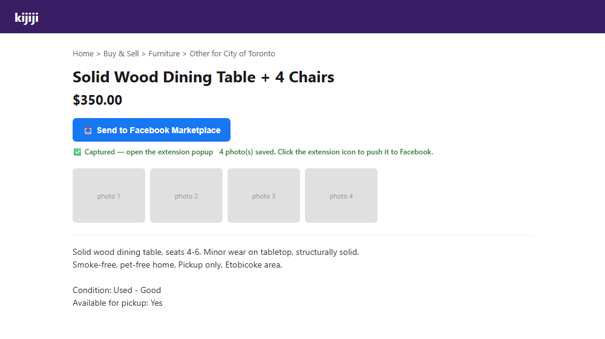
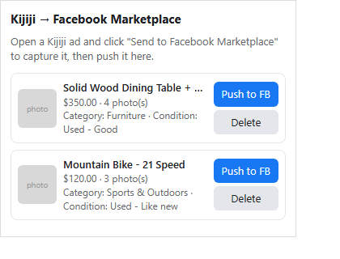
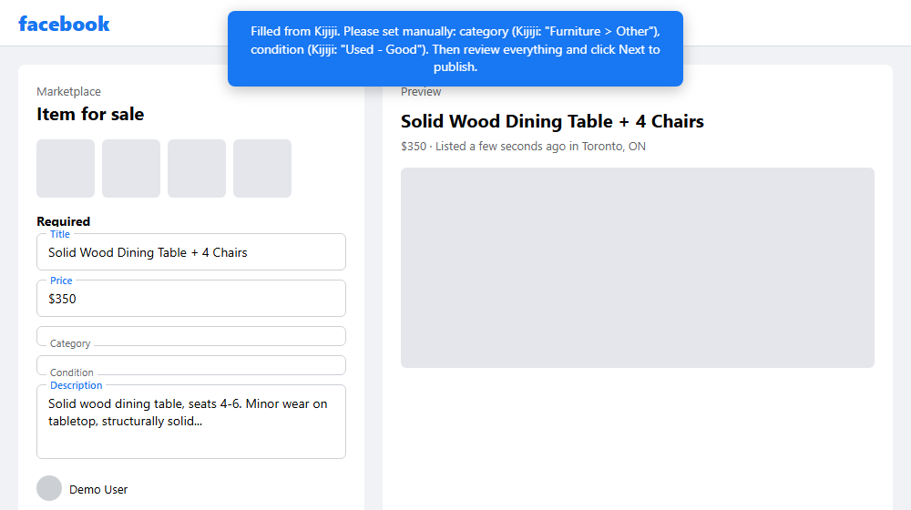

# Kijiji to Marketplace

A Chrome extension that captures a Kijiji ad with one click and auto-fills
a new Facebook Marketplace listing from it (title, price, description,
photos — category and condition are left for you to pick, see below).
One-directional: Kijiji → Facebook Marketplace only. Free, no limits.

## Install from the Chrome Web Store

Install the official published extension in one click:

[**Install Kijiji to Marketplace**](https://chromewebstore.google.com/detail/kijiji-to-marketplace/ijmonbgcgokccaalihpeeidiblbncnan)

> **Not affiliated with, endorsed by, or sponsored by** Kijiji, eBay
> Canada, Meta Platforms, Inc., or Facebook. "Kijiji" and "Facebook
> Marketplace" are used here only to describe what this independent,
> unofficial tool is compatible with.

> The screenshots below are sanitized mockups (placeholder listing, generic
> account name) built to illustrate the flow without exposing anyone's real
> Kijiji/Facebook account.

**1. Capture on Kijiji** — a button is injected above the ad title:

**2. Review captured listings in the popup:**

**3. Auto-filled on Facebook Marketplace, ready for you to review and publish:**

## What's new in v0.5.2

- Official Chrome Web Store listing: [Kijiji to Marketplace](https://chromewebstore.google.com/detail/kijiji-to-marketplace/ijmonbgcgokccaalihpeeidiblbncnan)
- Public GitHub project page with direct installation and release links.
- More robust fallback matching for Facebook form fields when labels or DOM structure shift.
- Clearer cleanup of stale pending listings if the Facebook tab is closed or the form is abandoned.
- Safer photo downloads with fail-fast checks for broken or non-image responses.
- Better popup UX, including a clear-all action and better status/error feedback.
- Stored listings are now capped and sorted to avoid stale local clutter.

## Install a developer build

1. Open `chrome://extensions`
2. Turn on **Developer mode** (top right)
3. Click **Load unpacked** and select this folder (`D:\Dev\5-kijiji+Marketplace`)

## Use

1. Open your ad on Kijiji (a `kijiji.ca/v-...` page — e.g. from **My Ads**).
2. Click the blue **📤 Send to Facebook Marketplace** button injected above the title.
3. Click the extension icon in the toolbar to open the popup — your captured listing appears there.
4. Click **Push to FB** — it opens (or reuses) a Facebook Marketplace "create listing" tab and auto-fills:
   - Title
   - Price
   - Description (Kijiji's description + any Kijiji attributes, appended)
   - Photos (re-uploaded from Kijiji's images)
   - **Category and Condition are intentionally left for you to pick**
     (see below) — both are still captured from Kijiji and shown as hints
     in the popup and in the on-page banner.
5. **You still review and click Next/Publish yourself.** A banner on the
   page tells you exactly which fields (if any) it couldn't fill and need a
   manual look.

## Why Category and Condition are manual, on purpose

Facebook's Category and Condition fields are custom picker widgets, and
testing showed they silently ignore script-dispatched mouse events —
including a full `pointerdown`/`pointerup`/`click` sequence with correct
coordinates — while a real, physical click selects an option instantly.
This looks like a deliberate anti-automation guard (probably checking
`event.isTrusted`).

The only reliable programmatic workaround found for that was
`chrome.debugger` (the Chrome DevTools Protocol, the same mechanism tools
like Puppeteer use) to inject a genuinely trusted click from the browser
process itself. This extension **does not use it** — that permission is
one of the most heavily scrutinized by Chrome Web Store review, and using
it to defeat a site's own anti-automation guard is exactly the kind of
thing that gets extensions rejected or later pulled. So both fields are
left for a one-click manual pick instead; the Kijiji category/condition
values are still captured and surfaced to you so you know what to choose.

Title, Price, and Description don't have this problem — setting their
value via a native property setter + `input`/`change` events is accepted
by Facebook's React form normally, no trusted click needed.

## Why the final Publish click is still manual

The extension deliberately does **not** click Next/Publish for you:
- Facebook's form can add extra required fields depending on category
  (e.g. brand, size), so a "smart" auto-submit would fail unpredictably.
- Automating the final publish step on someone else's platform risks
  tripping spam/bot detection and getting your account flagged — a quick
  manual review + click avoids that risk entirely, and only costs one or
  two clicks per listing.

## How it works

- `content-kijiji.js` — injected on Kijiji ad pages. Scrapes the DOM
  (title, price, description, attribute pairs like Condition, a cleaned
  category path from the breadcrumbs, photo URLs) and sends it to the
  background service worker.
- `background.js` — stores captured listings in `chrome.storage.local`,
  fetches photo bytes (from the background context so it isn't blocked by
  page-level CORS), and opens/refreshes the Facebook tab when you push a
  listing.
- `content-facebook.js` — injected on
  `facebook.com/marketplace/create/*`. Facebook has no aria-labels or
  test-ids on any of these fields; instead each one is
  `<label>Field name<input></label>` (a floating label
  pattern), so fields are found by matching that exact visible label text.
  Title/Price/Description are filled directly; photos are attached to the
  file input via `DataTransfer`. Category and Condition are left untouched
  for manual selection (see above).
- `popup.html` / `popup.js` — lists captured listings so you can push or
  delete them.

## Known limitations

- **Facebook's DOM changes without notice.** If a field stops filling,
  open DevTools on the create-listing page, inspect the field, and check
  the exact visible label text — then update the label strings passed to
  `fillTextField(...)` in `content-facebook.js`.
- **Category and Condition are always manual** — see "Why Category and
  Condition are manual, on purpose" above.
- Only handles items where Kijiji shows a single numeric price ("Please
  Contact" / "Swap/Trade" listings get no price — you'll set it manually).
- Captures whatever photos are visible in the Kijiji gallery thumbnails;
  very large galleries may take a moment to re-upload.

## Project links

- [Install from Chrome Web Store](https://chromewebstore.google.com/detail/kijiji-to-marketplace/ijmonbgcgokccaalihpeeidiblbncnan)
- [Source code and issue tracker on GitHub](https://github.com/51sec/kijiji-to-marketplace)
- [Privacy policy](PRIVACY.md)

If this extension saves you time, please share the [Chrome Web Store
listing](https://chromewebstore.google.com/detail/kijiji-to-marketplace/ijmonbgcgokccaalihpeeidiblbncnan)
or star the [GitHub repository](https://github.com/51sec/kijiji-to-marketplace).

## Chrome Web Store readiness

This extension is built with Chrome Web Store review in mind:

- **No `chrome.debugger` permission** — removed along with the
  Category/Condition auto-select it powered (see above).
- **Permissions trimmed to the minimum that's actually used**: only
  `storage` and `unlimitedStorage` remain in `permissions`. `activeTab`
  was requested but never used (removed — an unused permission is itself
  a common rejection reason). `tabs` was also removed: `chrome.tabs.
  create`/`update`/`reload` don't require it, and the one call that
  filters by URL (`chrome.tabs.query({ url: ... })`, used to reuse an
  already-open Facebook tab) works via host permission instead, per
  Chrome's documented behavior. `host_permissions` is scoped to exactly
  `media.kijiji.ca` (to fetch the ad's photos) and the one Facebook path
  the extension actually fills in
  (`facebook.com/marketplace/create/*`) — nothing broader. Reading the
  Kijiji ad page itself is a separate, narrower `content_scripts` match
  on `kijiji.ca/v-*`, not a host permission.
  ⚠️ Worth a live re-test after this change, specifically the "reuse an
  already-open Facebook tab" behavior in `PUSH_TO_FACEBOOK`, since it
  couldn't be verified end-to-end without the real extension loaded.
- **Real icons** are included at `icons/icon16.png`, `icons/icon48.png`,
  `icons/icon128.png` and referenced from `manifest.json`.
- **A privacy policy is included**: [PRIVACY.md](PRIVACY.md) — everything
  the extension reads stays local to your browser; nothing is sent to any
  server the developer operates. Use the raw GitHub URL to this file as
  the "Privacy policy" link in the Developer Dashboard listing.
- **Single purpose**: capture a Kijiji listing and pre-fill it into a new
  Facebook Marketplace draft. It does not do anything else.
- **A promo tile** is included at
  [store-assets/promo-tile-440x280.png](store-assets/promo-tile-440x280.png)
  (440×280, the Chrome Web Store's "small promo tile" size) — upload it
  under the listing's store assets. It spells out "Kijiji → Marketplace"
  in plain text (fine — naming a brand in text to describe compatibility
  is normal fair use) since that's illegible at actual icon sizes but
  works fine on a large promotional tile.
- Still worth double-checking before submitting: add real screenshots
  (1280×800 or 640×400) and short/full descriptions in the Developer
  Dashboard, and fill out the permissions-justification form referencing
  the bullet points above.

## License

**Copyright © 2026 Jon Netsec / 51Sec Inc. All rights not expressly granted
below are reserved.**

This project is licensed under the [MIT License](LICENSE). In plain terms,
that means:

- ✅ **Use** — you may run and use this code, privately or commercially, at
  no cost.
- ✅ **Modify** — you may change, extend, or build on top of it.
- ✅ **Redistribute** — you may share it, bundle it, package it as a
  browser extension, or publish a fork of it, including for commercial
  purposes.
- ⚠️ **On one condition, with no exceptions:** every copy or substantial
  portion of this software that you use, modify, or redistribute — as
  source code, a packaged/compiled extension, or a fork — **must retain
  the original copyright notice above and the full MIT license text.**
  This is not a courtesy request; it is Section 2 of the license text you
  are bound by the moment you use this code, and it is legally
  enforceable.

**What this means concretely:**
- Do **not** delete, edit, or paraphrase the copyright notice.
- Do **not** re-license a fork or derivative under your own name/company
  without keeping this notice.
- Do **not** present this work, in whole or substantial part, as your own
  original creation.
- Forks, mirrors, and redistributed packages must carry this same notice
  and a copy of the [LICENSE](LICENSE) file.

Doing any of the above is a license violation, not a gray area, and the
copyright holder (**Jon Netsec / 51Sec Inc.**) reserves the right to
enforce it.

This software is also provided **"as is," with no warranty of any kind**
(see [LICENSE](LICENSE) for the full disclaimer) — you use it entirely at
your own risk, including with respect to any third-party platform's (e.g.
Facebook's) terms of service.
